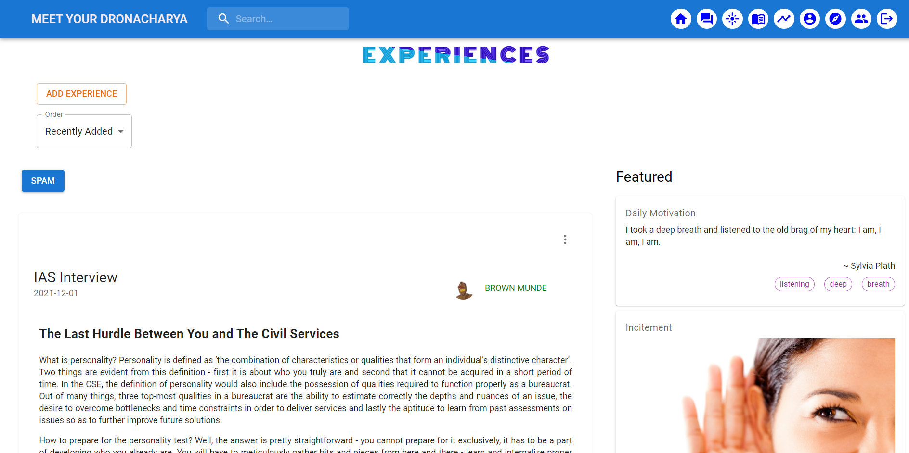
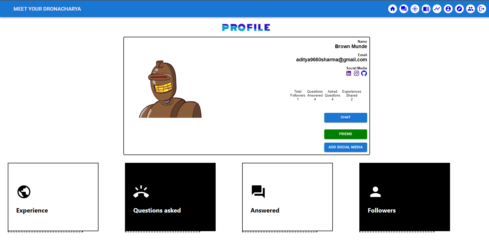

# Meet Your Dronachrya

## IMPORTANCE

Sadly, in our country many students do their graduation first and then think about their career of interest, because of this we are developing a working class which might be good at their work but not interested in it, so we are not able to innovate much as compared to other developed nations.

The main goal of our website is to help someone with their career  path as **ACHARYA DRONACHARYA** helped Arjun, and we will do it not just by ourselves but with the help of a community. 

We have developed a platform where one can come and do various activities such as asking doubts about their career as a student, add experience as an expert, share study material as a senior and discuss things as friends. We also have things such as a timeline for important events/exams and a page to find your career interest. (we will discuss each of them individually in detail in later sections). 

---

## UNIQUENESS 

The joy of having a single platform for all the things related to career is immeasurable, which is the core of our application. Our application has all the necessary things a student might want, for example if you are confused about the career path we have “Find Myself” section where you can select career path, if you are in some doubt we have “Ask Something” section to as the doubt, if you are an experienced individual and want to help your juniors we have “Add Experience” section, if you want to share your previous study material we have also covered that, if you just want to see the important dates of exams we also cover it in “Timeline” section, so over website covers all the important aspects of a user. From a technical perspective along with using technologies such as ReactJS, NodeJS, ExpressJS and MongoDB for our website we will also use Natural Language Processing techniques to enhance the website's use and make it a different platform from its peers (like Quora).

---
## COMPONENTS

## Home Page 
The main page for the website from which a user can navigate to all the different pages. Search box is implemented to search any content of the website like finding any material of any specific courses or finding experts of their required domain. This page also contains sign in options. Till now we have implemented the frontend of the page but the search options need NLP techniques so we have shifted this to the next release.  

## Ask Something 
A student can ask anything strictly related to their careers from the experts by writing or adding images. A complete list of previously asked questions and their answers will be displayed. Login is compulsory to ask questions and to answer/like them. Users will also have options to sort the questions in various ways like according to time, likes and his own questions. The page is done with both frontend and backend work. In the next release we will add features of deleting/editing in the questions asked by a user, along with a better and more interactive UI and some way to display questions to a user according to their interest (possibly by using NLP).

## Experience 
An expert can share their experiences like challenges faced while choosing careers, or answering some specific questions like “Why did they choose this career?”, “Are they happy about their decision?” or anything strictly related to their career. Anyone who had an experience in the past can share their experience so that others can learn from the mistakes they made and thoughts can be shared. Login is necessary to post/like experiences. This page will also contain a news feed which we will implement using an API for news so that students can be up-to-date with what is happening in their fields.

## Find myself
A question set which will be designed by experts which will help students to find a better career path by answering them. A recommended career choice will be soon along with relative grading of all other career choices. We have added many questions for this and also implemented a logic to find career choices but we will also add a feature to add questions which will require the user to be an expert so that we don’t get so many 
spam questions.

## Study Material
Any user can share their study material as it helps others in preparing better for their exams. They can like the  material and also share it. By now we have implemented the frontend for this and also implemented a backend except storing study material as pdf or photos which we will do in the next release). We will also add a feature for professional teaching institutes to add study material.

## Timeline
A complete timeline of all the major competitions of India will be displayed here.Displaying is done in two ways: All combined and each separated. One can bookmark exams and a notification email will be send to them as date approaches (something that we will implement while implementing the node mailer). 

## About us
This is to give a clear idea, purpose and how to contribute to help the students to find a perfect career path for them. We will add information to contact the owners for any business related query.

## Dashboard
A dashboard for all students and experts showing their contribution to other student’s path guidance through this website. We will also add a chat system using socket.io so that a student can directly get connected to experts. We have implemented the frontend but have not connected the user to this via the backend.  

## Login
Login is compulsory to make a contribution or ask any doubts and to answer them so that, website is reliable and to ensure no spamming. Further, login will be used to distinguish students, experts and developers. Till now, we have implemented sign up and google sign in. Later, we will add “forgot password” and will allow users to change their password using two security questions or via gmail using node mailer.

Link to github repository: [Repository link](https://github.com/PandaKing9660/MeetYourDronacharya)

Link to deployed site: [Website Link](https://meetyourdronacharya.netlify.app/)

## Individual Contributions

- **Aditya Sharma**
  - Login (Frontend and Backend)
  - Ask Something (Backend)
  - Experience (Backend)
- **Amit Kesari**
  - Home page (Frontend)
  - Ask Something (Frontend)
  - Experience (Frontend)
  - Timeline (Frontend)
  - Navbar and Footer

- **Anu Anand Annu**
  - Home page (Frontend)
  - Find passion (Frontend)
  - About us (Frontend)
  - Study Material (Backend)

- **Emani Naga Sai Venkata Sowmya**
  - Dashboard (Frontend)
  - Timeline (Frontend)
  - Study material (Front end)

