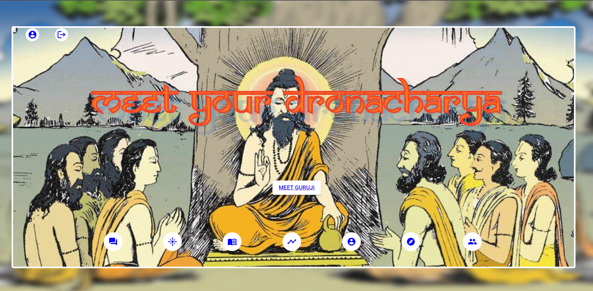
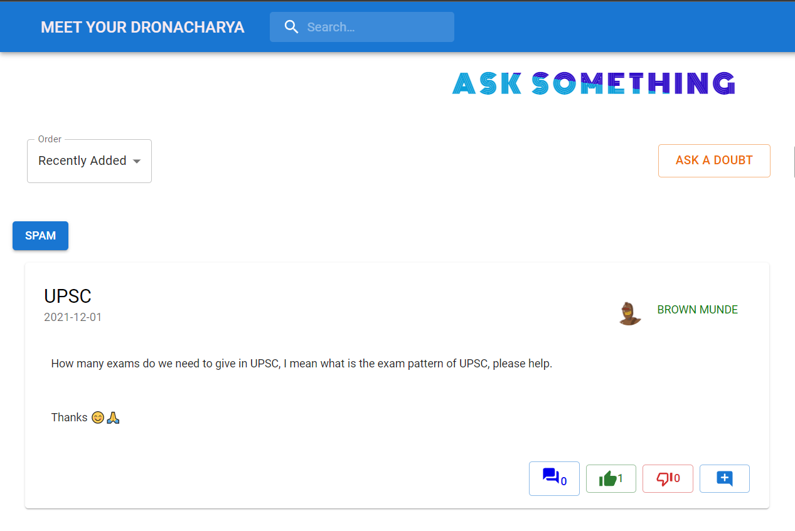
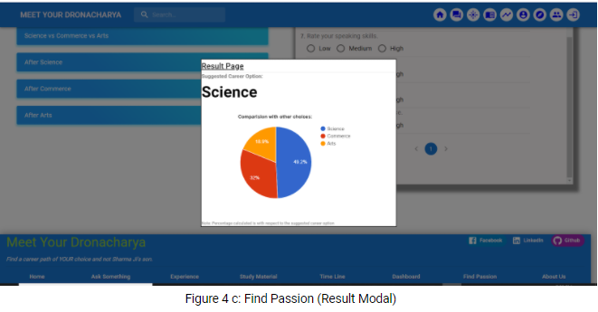
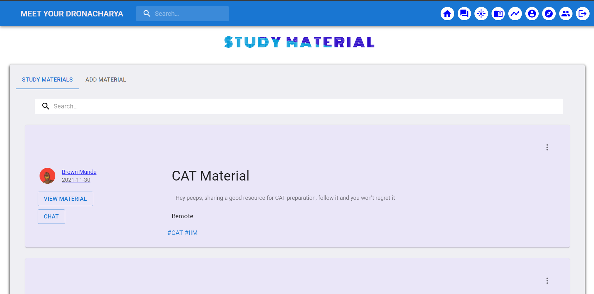
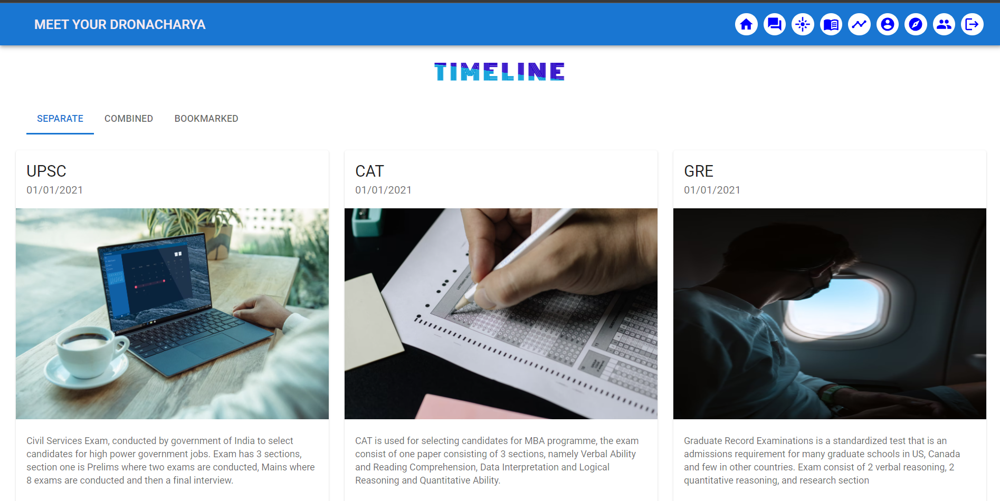
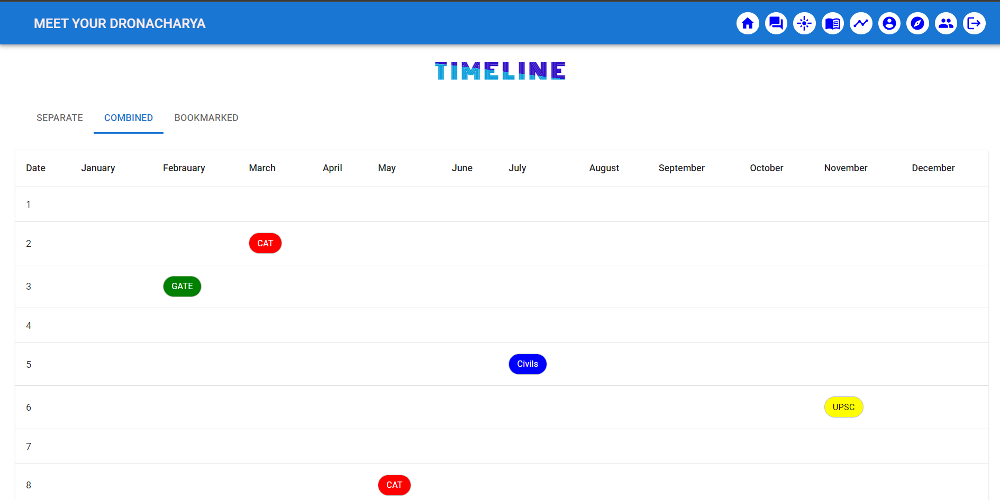
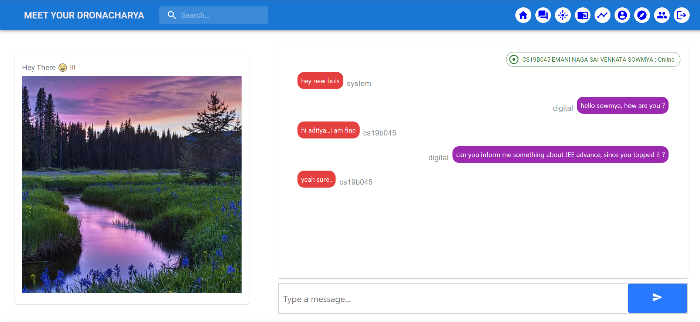

# Meet Your Dronachrya

## IMPORTANCE

Sadly, in our country many students do their graduation first and then think about their career of interest, because of this we are developing a working class which might be good at their work but not interested in it, so we are not able to innovate much as compared to other developed nations.

The main goal of our website is to help someone with their career  path as **ACHARYA DRONACHARYA** helped Arjun, and we will do it not just by ourselves but with the help of a community. 

We have developed a platform where one can come and do various activities such as asking doubts about their career as a student, add experience as an expert, share study material as a senior and discuss things as friends. We also have things such as a timeline for important events/exams and a page to find your career interest. (we will discuss each of them individually in detail in later sections). 

---

## UNIQUENESS 

The joy of having a single platform for all the things related to career is immeasurable, which is the core of our application. Our application has all the necessary things a student might want, for example if you are confused about the career path we have “Find Myself” section where you can select career path, if you are in some doubt we have “Ask Something” section to ask the doubt, if you are an experienced individual and want to help your juniors we have “Add Experience” section, if you want to share your previous study material we have also covered that, if you just want to see the important dates of exams we also cover it in “Timeline” section, so our website covers all the important aspects of a user. From a technical perspective along with using technologies such as ReactJS, NodeJS, ExpressJS and MongoDB for our website we will also use Natural Language Processing techniques to enhance the website's use and make it a different platform from its peers (like Quora).

Using features like Chatbot, Spam Detection and Chat feature make our website more useful than other similar platforms.


---
## COMPONENTS


## Home Page 
The main page for the website from which a user can navigate to all the different pages. Meet guruji button will open a chat bot which is implemented by us from scratch using basic NLP techniques like Steaming, Tokenization etc, to improve user experience. This page also contains sign in options. It also contains navigation links to other pages of the website. 




## Chat Bot
A Chatbot (Guruji) made by the team using NLP techniques to improve user experience and help them to understand the working of a website.


## Ask Something 
A student can ask anything strictly related to their careers from the experts by writing or adding images. A complete list of previously asked questions and their answers will be displayed. Login is compulsory to ask questions and to answer/like them. Users will also have options to sort the questions in various ways like according to time, likes and his own questions. Spam Detection is also done at the time of submission, according to that we keep the spam questions in different tabs. One can also edit and delete their answers.





## News Feed
A news feed API is implemented with which a user can search about a particular topic in the Binge browser and can get their answers if they wish to.

## Spam Option
One can check the spam post done till now by clicking the Spam button on the right side, and check the spam posts, one can’t do anything to the spam post and it will be deleted after sometime.


## Answers
After a Question is posted one can answer it directly, spam will be detected and put in another part. Users also have the options to edit and delta their answers in case they feel the answers are not upto the mark.

## Search
Search option is implemented and can be used on all the questions, answers and experiences. One can search for user, tag and heading.


## Experience 
An expert can share their experiences like challenges faced while choosing careers, or answering some specific questions like “Why did they choose this career?”, “Are they happy about their decision?” or anything strictly related to their career. Anyone who had an experience in the past can share their experience so that others can learn from the mistakes they made and thoughts can be shared. Login is necessary to post/like experiences. This page also contains a motivation quote API which gives motivation to the users. The functionalities like Spam checker, search bar, edit, delete are still implemented in the experience section.


## Find myself
A question set is designed by experts which will help students to find a better career path by answering them. A recommended career choice will be soon along with relative grading of all other career choices. We have added many questions for this and also implemented a logic to find career choices. An option of adding a question to the database is also given, for stopping the span question the process will not be direct rather will be via using google forms.





## Study Material
Any user can share their study material as it helps others in preparing better for their exams. Big companies can also market their brand here as a location tag will also be there. One can also chat with the owner in order to get more details. Search option is also available on the page along with a delete option. 





## Timeline
A complete timeline of all the major competitions of India will be displayed here.One can also bookmark any exam to directly check about the exam. A calendar view is also available for the user for better understanding. Some notification messages can be sent to the user once the date comes closer.







## About us
This is to give a clear idea, purpose and how to contribute to help the students to find a perfect career path for them. We will add information to contact the owners for any business related query.


## Dashboard
A dashboard for all students and experts showing their contribution to other student’s path guidance through this website. We have also added a chat system using socket io so that a student can directly get connected to experts or other students. One can also add their social media accounts into the website and can even follow the user. 


## Chat
Implemented a Chat option using Socket.io and backend to save chat. One can communicate with anyone.




## Login
Login is needed to use many applications of the website like asking questions, sharing experience, answering questions, sharing study material, chatting and finding the dashboard. A forgot password function is also implemented using nodemailer. Once you click on forget password then one OTP will come to your mailbox. Then one can change their password. 


Link to github repository: [Repository link](https://github.com/PandaKing9660/MeetYourDronacharya)

Link to deployed site: [Website Link](https://meetyourdronacharya.netlify.app/)


---

## Set up
Clone the repository and install the dependencies. Run the following commands:
```
>>> git clone git@github.com:PandaKing9660/MeetYourDronacharya.git 
# replace [PandaKing9660] with your github username if you fork first.

>>> cd ./MeetYourDronacharya
>>> npm install
>>> cd ./client
>>> npm install
>>> cd ../server
>>> npm install
>>> cd ..

```

## Running
Run the following command to build the MERN stack application and serve it on local host. Frontend runs on [http://localhost:3000/](http://localhost:3000/) and backend on [http://localhost:3001/](http://localhost:3001/) by default.
```
>>> npm run dev 
# for running both frontend and backend together in the local host. Make sure you are in the main ./MeetYourDronacharya directory.

```

---


## Individual Contributions

- **Aditya Sharma**
  - *Login/ Signup/ Auth:* Implemented login/ signup/ google sign in for the website. Also added forgot password using Node Mailer.
  - *Ask Something:* Did backend for “Ask Something” i.e., storing questions, answers, number of likes/ dislikes in the MongoDB of a user.
  - *Experience:* Did backend for “Ask Something” i.e., storing experience, number of likes/ dislikes in the MongoDB of a user.
  - *Dashboard:* Implemented backend of the dashboard i.e., storing users details and also providing users a chance to update his/her profile and see others. Follow/ Unfollow and contribution to the website is also stored in the MongoDB.
  - *Node mailer:* Node mailer is used to send OTP to the user gmail account in case he/she forgets password.
  - *Chat Bot:* Implemented a chatbot called “Guruji” using NLP (Stemming and Tokenization) from scratch.
  - *Chat:* Designed a way to save chats in MongoDB. 
  - *Search bar in navbar:* A search bar to search the inputs in the whole module to make users find the stuff easily.

- **Amit Kesari**
  - *Home Page:* Frontend and basic functionalities of the homepage including navbar and footer.
  - *Ask Something:* Frontend and lower level functionalities of the Ask Something Page like showing questions/ answers of all the users. Uploading questions/ answers using TINY MCE.
  - *Experience:* Frontend and lower level functionalities of the Experience Page like showing experiences of all the users. Uploading experiences using TINY.
  - *Timeline:* Frontend and basic functionalities of the Timeline Page.
  - *Newspoint:* Called an API to show random and latest news in Ask Something Page.
  - *Spam Removal:* Called an API and used NPL to separate out spams from being added in the Ask Something or Experience page.
  - *Daily Motivation Feature:* Called an API to display random motivation slogans and a picture in the Experience Page. 
  - *ChatBox:* Implemented Chat of the users using socket.io in realtime and saving it in the MongoDB.
  - *Login SignUp Design:* Revamped the design for Sign In and Sign Up pages.
  - *404 page:* Implemented the wrong URL 404 page.

- **Anu Anand Annu**
  - *Home Page:* Frontend, basic and lower level functionalities and responsiveness of homepage.
  - *Find your passion:* Frontend, basic and lower level functionalities of Find your Passion page. Adding a question set, calculated results and shows career choice as well as relative grading of other career options. Implemented a way to add question set by a third party.
  - *About Us:* Frontend, responsiveness and content of the About Us page.
  - *Study Material:* Did backend for “Study Material” i.e., user details and demo material.
  - *Dashboard:* Frontend and responsiveness of the Dashboard Page.
  - *Chat Bot:* Implemented a chatbot called “Guruji” using NLP and added a database for it to respond to the user message.
  - *Ask Something:* Frontend, responsiveness and basic backend for the Ask Something. 
  - *Timeline:* Responsiveness of the Timeline Page.

- **Emani Naga Sai Venkata Sowmya**
  - *Study Material:* Frontend and basic functionalities of Study Material like uploading and displaying of the Study Material
  - *Dashboard:* Frontend and lower level details of the Dashboard.
  - *About Us:* Frontend of the About Us.
  - *Timeline:* Frontend, lower level functionalities and content of the Timeline Page. Added bookmarks for all the users in the backend.
  - *Experience:* Backend of the Experience page to edit and delete experiences of the user. Implemented backend to store tags for the post which will help to search them.
  - *Ask Something:* Implemented backend for the Ask Something Page to edit and delete questions and answers of the user.


